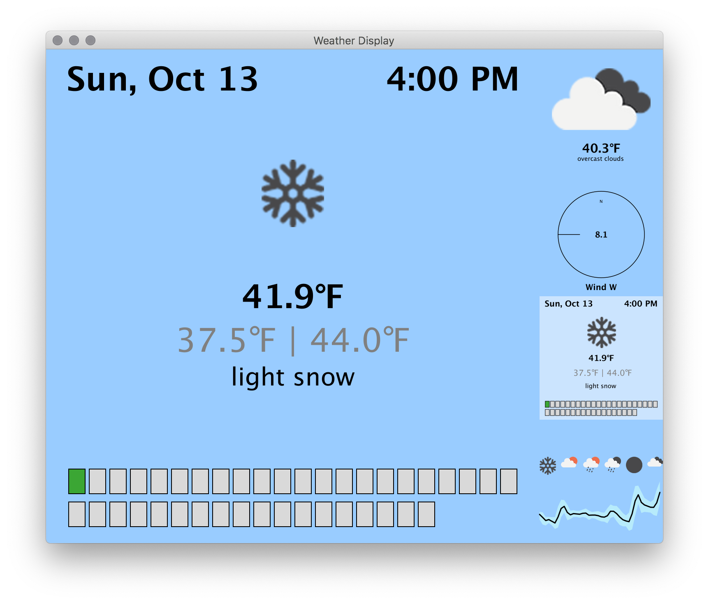
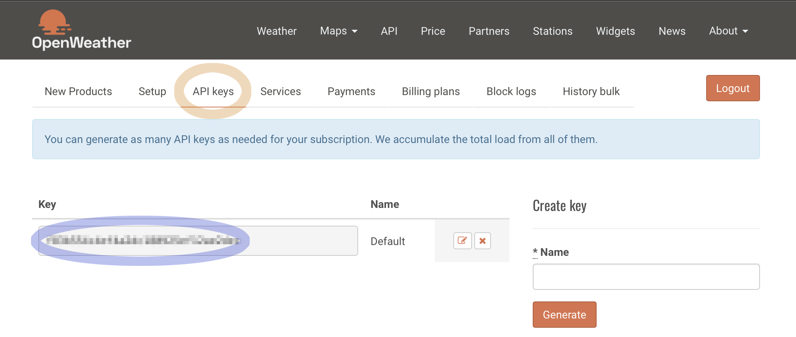
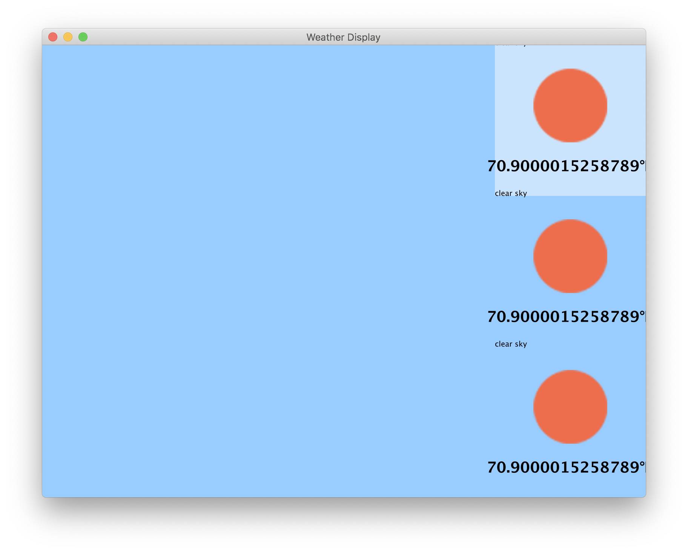
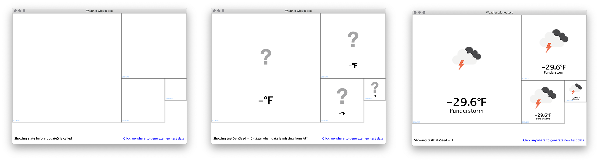
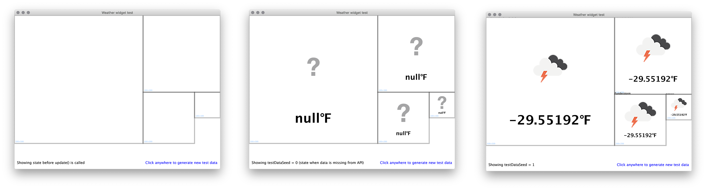
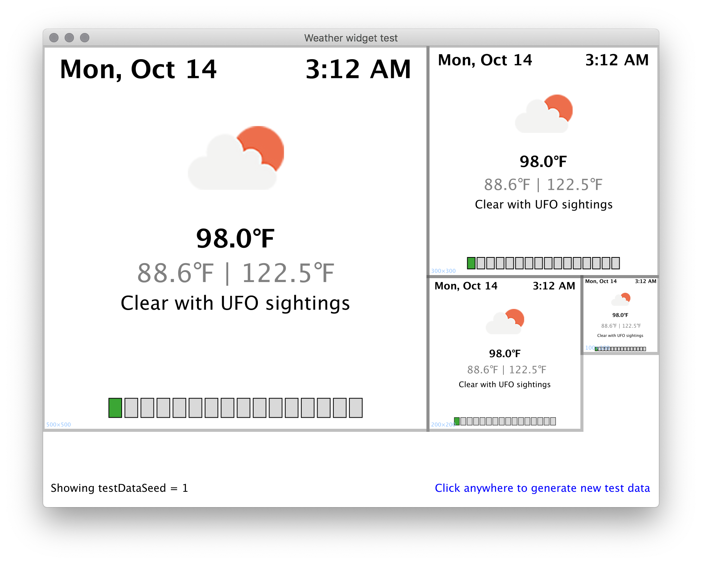

# Homework 3: Weather Display

## Overview

In this assignment, you will create an app that shows weather information. The program will use real weather data from [OpenWeather](https://openweathermap.org). We have created code to handle getting the data from OpenWeather, and have given you a start on the UI. You will complete the UI.

When you are done, your results might look something like this:



…but what you create will be different, because you will invent two of your own weather widgets!

As always, make sure to follow the [Comp 127 Java Style Guide](https://docs.google.com/document/d/1KB3T5can3aC5qygtdjKTUzl0P3c8BlN1QaWy4rIc2F0/edit?usp=sharing).

### Attributions

We have used the owmjapis and org.json packages (both of which are open source) to create our wrapper class and make the data accessible to you. You do not need to know how these packages work, but if you would like more information about them, you can check out the following links:
- [owmjapis](https://bitbucket.org/akapribot/owm-japis)
- [json](https://github.com/stleary/JSON-java)

The original version of this activity was by Bret Jackson, with heavy contributions from Daniel Kluver and Paul Cantrell.


## Getting an API Key

You will first need to get your own OpenWeather API key, so you can use their web API. Do this by signing up for a free account at [https://openweathermap.org/appid](https://openweathermap.org/appid).

> **What is a web API?** In general, an “application programming interface,” or “API” for short, is a way for code to talk to other code. You are already used to using _library APIs_ such as `List`. These APIs let code communicate with other code on the same computer. But code can also provide data to other code across the Internet. We call that a “remote API,” or if it specifically uses web technology such as HTTP, a “web API.”

> **What is an API key?** OpenWeather provides this API for free, so that people can build apps and do research. The API key lets them know who is requesting data. This lets them have some paid features, and lets them shut down a particular account if it is abusing the system (e.g. by making too many requests).

Once you've completed the sign up page, it will take you to your account welcome page. Select the next tab over from "Setup", which is the “API keys” tab (see picture below, circled in orange).



(Note: as of this writing, there is a bug in the OpenWeather site which causes the tabs not to be visible for certain browser window widths. If you can’t see the tabs, make your browser window wider.)

You have a default API key already, so copy that (circled in blue).

Now, in the `res/` directory of your project, create a new file named `weather-display.properties`, and put this one line in it:

    api.key=???????

…where `???????` is the API key you copied.

Run `WeatherProgram` to test your API key. If it works, you will see a weather display that is not very pretty, but has the real-life current weather conditions for Macalester:




## Part 0: Understanding the existing code

### Data model

In the `comp127.weather.api` package, look at these classes:

- `WeatherData`
- `Conditions`
- `CurrentConditions`
- `ForecastConditions`

Study the relationships between these classes. (How are they connected? What are the has-a and is-a relationships between them? What is the role of each class? It might be wise to diagram this.)

These classes have some tricky code in them, including some Java features we have not studied in class. But don’t worry! You only need to **use these classes, not modify them** or understand how they work. That means that you can just pay attention to the **public method signatures** and their accompanying Javadoc. For example, in `WeatherData`, the signature of the first public member is:

```java
public String getCityName()
```

These public methods are what you will use to get data for your weather UI. Note that these classes provide _just the data_; none of them say anything about _how the data will be displayed_. This kind of “no view, just data” classes are called a **data model**. You will need to be familiar with the data model to build your UI.

### User interface

Look inside the `comp127.weather.widgets` package. There is an interface called `WeatherWidget`, plus a start on two specific widgets that implement it. You will complete those two widgets, and add two of your own. Study `WeatherWidget` and understand the methods that each widget must implement.

There are also a few classes that will help you implement widgets. Take a look at them, and understand what they offer you.

In the `comp127.weather` package, take a look at `WeatherProgram`. This is the full UI that is going to display your widgets. You can run it now if you want! It will fetch real weather data for St. Paul. However, it currently just shows the same widget four times, and does not yet show an enlarged version of the selected widget as it is supposed to.

If you see nothing but question marks, that means either you have not put your API key in the correct place, or your key is not active yet. Even if your API key is not active yet, however, you can still proceed with the assignment, because of the…

### Testing strategy

In the `test` directory, in the `comp127.weather.widgets` package, run `SingleWidgetTest`. This class is designed to help you test new widgets as you develop them. Right now, it is set up to test `TemperatureWidget`, but you will eventually use it to test others too.

Much like `WeatherProgram`, this class displays widgets on a canvas. However, there are two important differences:

- **It shows just one widget at many different sizes.** This is to make sure the widget scales itself properly, so that it looks good whether it is large or small.
- **It uses fake data generated for testing.** Why use fake data?
    - The fake data is designed to exercise a wide range of possible conditions, including **edge cases** such as missing data and extreme values.
    - The fake data **does not use the network**, so your tests run faster (and don’t unnecessarily pummel the OpenWeather servers).
    - The fake data it uses is **stable**, i.e. the same every time. This means that if you catch a bug, you can retest your widget with the same data to make sure you fixed it. A stable, repeatable test environment like this is called a **test fixture**. (You can see how the fake data is generated in `WeatherDataFixtures`. In this project it is arbitrarily generated, but fixture data is often hand-designed or captured from real data.)

When `SingleWidgetTest` runs, you should see a blank screen. This is how the widget will look before it gets any data from OpenWeather, i.e. while it is loading.

Click anywhere. You will now see how the widget looks when the server responds with everything blank that is allowed to be blank.

Click again. You will see a variety of different weather conditions.

Do you notice that `TemperatureWidget` doesn’t look quite right?


## Part 1: Fix `TemperatureWidget`

We want `TemperatureWidget` to look something like this:



…but right now, it looks like this:



There are several problems:

- It does not handle null temperatures well. (User interfaces shouldn’t show the word “null.”)
- It shows the temperature to a ridiculous number of decimal places.
- The textual description of the weather condition is stuck almost entirely outside the box in the upper left.

Your first task: **fix these problems** to make `TemperatureWidget` work properly.

You will find a few hints in the code. And here is one more hint:

You can use `FormattingHelpers.ONE_DECIMAL_PLACE.format(...)` to convert a double to a string with only one decimal place. However, this will not handle null correctly; before formatting the temperature, you will need to check for null. You will need to do this check a lot, so consider adding a new static method to `FormattingHelpers` that uses `ONE_DECIMAL_PLACE` but also checks for null first. (You could even make `ONE_DECIMAL_PLACE` private so you don’t accidentally use it from your widgets, and have to use your null-safe helper instead.)

Use `SingleWidgetTest` to make sure the widget works with a wide variety of input data.


## Part 2: Create your own widget

Using the general structure of `TemperatureWidget` as a guide, invent your own weather widget. You might use the second widget (the one that shows wind) in the screenshot at the very top of this document for inspiration. You might also be inspired looking through what is available to you in `WeatherData` and its related classes. Just make sure that your new widget does something new and different from the temperature widget. Be creative!

I recommend making this first widget focus on `CurrentConditions` only, and not deal with future forecasts. Forecasts will come in the next steps.

To test your new widget, change `SingleWidgetTest` to run it instead of the temperature widget.

Helpful Notes:
- To learn about what kinds of graphics you can create, take a look at the [comp127graphics javadoc](https://mac-comp127.github.io/kilt-graphics/).
- Look at the tools in `FormattingHelpers`, and add your own formatters if you need new ones. (Don’t modify the existing formats. You’ll need them for the next part of the assignment.)
- The Java string "\u2109" is a degree symbol.


## Part 3: Complete `ForecastWidget`

Make the `ForecastWidget` look like this:



The boxes at the bottom represent a timeline of future forecasts. When the mouse moves over the boxes, it should change the forecast shown above.

The code contains some scaffolding and many hints.

As before, change `SingleWidgetTest` to test your widget. Test it thoroughly! There is a lot going on here, which means there are many possible bugs.


## Part 4: Complete `WeatherProgram`

You’ve been using the test code so long, it may be easy to forget the goal is to build a real app!

Go back to `WeatherProgram`, and find the `createWidgets()` method. This method gets called twice: once to make small widgets to run down the right hand side of the screen, and once to make large widgets to show one at a time on the left.

The layout logic for these widgets is all done, but you never see the enlarged widgets because `selectWidgetAtIndex()` is not implemented yet. Implement it according to the hints in the code.


## Part 5: Invent an even fancier widget

Now that you are a pro at working with this project’s approach to the UI, invent a second new widget of your own. Build this widget using similar rules as in Part 2, except now you should use at least two new pieces of data, which you can pull from future forecast data as well as current conditions.

Don’t forget to switch back to `SingleWidgetTest` to test your new widget first. Then add it to `WeatherProgram` to see your new widget in action!


## Wrapping up

When you are all done, you should have a weather display that looks something like this (but with your custom widgets):


- There are 4 widgets down the right side: the original temperature widget, the forecast widget, and 2 you invented yourself. (Any order for all those is fine. Use your good judgement.)
- You can click on a widget to see it enlarged.
- When the forecast widget is enlarged, you can hover your mouse over the timeline to see forecasts for different times.

Look good? Try using your weather app to decide what to wear tomorrow!


### Extra Credit

Invent additional weather widgets. Have fun!
